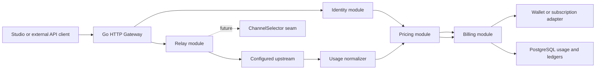
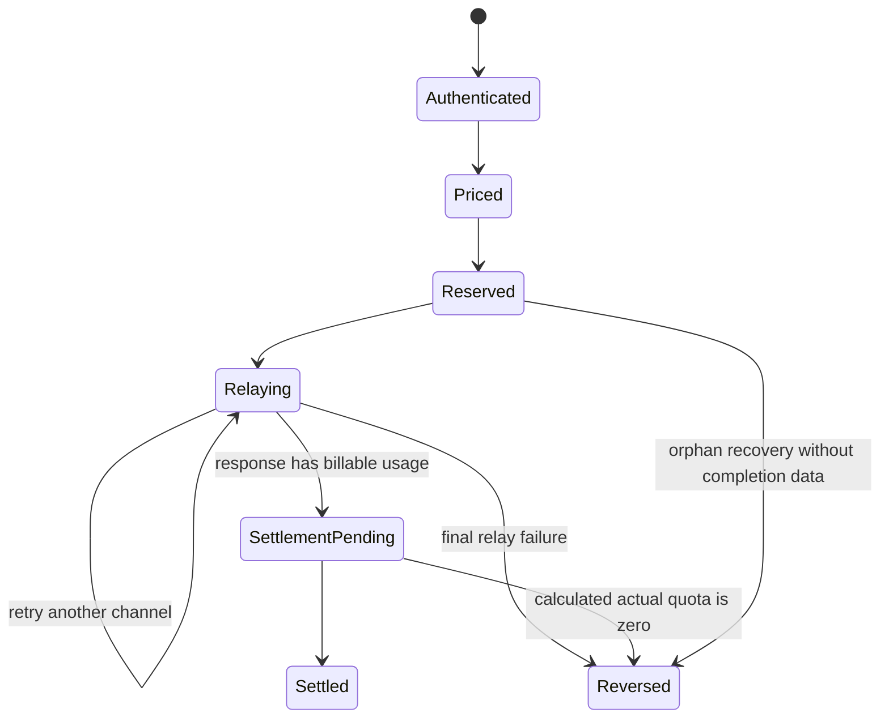

# Reizo Go Gateway Design

Status: approved design, pending implementation plan
Date: 2026-08-04

## 1. Summary

Reizo will replace the existing Fastify/Node.js/TypeScript Gateway with a
native Go Gateway. The Go process will preserve the current public transport
contract while adding new-api-compatible authentication, relay usage
normalization, pricing, pre-consumption, settlement, refund, subscription
fallback, API key quota enforcement, and billing audit behavior.

The implementation will not embed or fork the whole new-api application. It
will port the relevant new-api pricing and billing behavior into focused Go
modules, then adapt those modules to Reizo's users, API keys, wallets,
subscriptions, usage events, and immutable ledgers.

The final invariant is:

> Exactly one system owns customer billing for a request.

During migration, new-api remains the billing owner and Go runs in shadow mode.
Go may become authoritative only after parity checks pass and its upstream
credentials no longer cause new-api to charge the same request.

## 2. Goals

- Replace `services/gateway` Fastify source with a standalone Go executable.
- Preserve existing routes, headers, streaming behavior, health endpoints,
  readiness endpoints, capabilities output, and environment compatibility.
- Keep Auth.js unchanged. Next.js continues to validate browser sessions.
- Authenticate trusted Studio calls with the existing internal token and user
  ID headers.
- Authenticate external Reizo API keys directly from PostgreSQL.
- Match new-api pricing, usage fallback, pre-consumption, settlement, refund,
  API key quota, subscription, wallet fallback, and retry semantics.
- Normalize OpenAI-compatible, Anthropic Claude, Grok/xAI, image, and audio
  usage into one canonical representation.
- Import the effective production new-api pricing catalog into native Reizo
  PostgreSQL tables without creating a runtime dependency on new-api.
- Persist shadow calculations and expose an internal paginated reconciliation
  endpoint.
- Leave stable seams for database-backed channels, weighted selection,
  automatic retries, and a future new-api channel import.

## 3. Non-goals

- Copying the new-api web panel, administration UI, payment providers, or all
  relay adapters in the first implementation.
- Changing Auth.js session handling or asking the Go process to parse Auth.js
  cookies.
- Importing channel credentials as part of the pricing import.
- Running Fastify and Go as independent authoritative billing systems.
- Enabling Go authoritative billing while the same upstream new-api account
  also charges the request.
- Treating locally estimated usage as equivalent to upstream-reported usage in
  audit metadata. It may be billable for new-api parity, but its provenance
  remains explicit.

## 4. Confirmed Decisions

- The Go Gateway replaces Fastify rather than running as a permanent sidecar.
- Billing modes are `off`, `shadow`, and `authoritative`; the default is
  `shadow`.
- Native Reizo PostgreSQL tables are the runtime source of truth.
- Initial pricing is imported from production new-api through a one-time,
  idempotent command that is dry-run by default and requires `--apply` to
  write.
- Model price lookup, group ratios, decimal arithmetic, rounding, usage
  fallback, and the billing lifecycle follow current new-api behavior.
- In particular, absent upstream usage may be reconstructed from the request
  estimate and locally counted output, as new-api does.
- A final failed relay refunds the shared pre-consumption. Channel retries do
  not create independent customer charges.
- Unpriced models are rejected before relay in authoritative mode when
  self-use fallback is disabled, matching the inspected production setting.
- Go adds durable idempotency and crash recovery around the same billing
  result; these operational protections must not change the calculated amount.

## 5. Production new-api Baseline

The following facts were inspected read-only on 2026-08-04. No DSN, channel
key, user token, request body, or other secret was read into the design or
printed in reports.

| Item | Observed value |
| --- | ---: |
| PostgreSQL | 16.14 |
| Channels | 45 |
| Ability rows | 473 |
| Enabled ability models | 53 |
| Ability groups | 22 |
| `ModelRatio` entries | 286 |
| `ModelPrice` entries | 97 |
| `CompletionRatio` entries | 72 |
| `CacheRatio` entries | 104 |
| `CreateCacheRatio` entries | 54 |
| `ImageRatio` entries | 1 |
| `AudioRatio` entries | 5 |
| `AudioCompletionRatio` entries | 7 |
| Group ratios | 18 |
| Subscription plans | 4 |
| Active subscriptions | 5 |

`billing_setting.billing_mode` and `billing_setting.billing_expr` are present
but currently empty. `QuotaPerUnit` and `PreConsumedQuota` are not explicitly
persisted, so the effective source defaults are `500000` and `500`.

`SelfUseModeEnabled` is false. Eight enabled ability models have no exact
`ModelRatio` or `ModelPrice` entry in the inspected catalog: `gpt-5.6`,
`grok-3`, `grok-3-fast`, `grok-3-mini`, `grok-3-mini-fast`, `grok-4`,
`grok-4-1-fast-reasoning`, and `grok-4-fast`. They must not silently use the
self-use ratio or become free in authoritative mode.

Production includes OpenAI-compatible, Anthropic, Gemini, xAI, TTAPI Grok,
and a persisted channel type `60` that is not represented by the current local
new-api channel constants. Future channel import must preserve unknown raw
provider types and stage unsupported types as disabled rather than mapping them
to the wrong adapter.

## 6. Architecture



The HTTP module orchestrates a request but does not implement provider pricing
or mutate balances directly. Pricing and Billing are deep modules behind small
interfaces so adding new new-api rules or providers does not expand the HTTP
layer.

### 6.1 Go module layout

The implementation plan may adjust filenames, but responsibilities remain:

```text
services/gateway/
  cmd/gateway/             process entrypoint
  cmd/pricing-import/      one-time import command
  internal/config/         environment parsing and validation
  internal/httpapi/        routes, headers, errors, streaming handoff
  internal/identity/       internal token and PostgreSQL API key auth
  internal/relay/          upstream request and response lifecycle
  internal/usage/          canonical usage and provider normalizers
  internal/pricing/        new-api-compatible price lookup and calculation
  internal/billing/        reserve, settle, refund, reconciliation
  internal/storage/        PostgreSQL adapters
  internal/observability/  structured logs and metrics
```

### 6.2 Stable interfaces

The external seams are intentionally small:

```go
type PricingEngine interface {
    Quote(context.Context, QuoteRequest) (Quote, error)
    Calculate(context.Context, Quote, CanonicalUsage) (Charge, error)
}

type UsageNormalizer interface {
    Observe([]byte) error
    Complete(Completion) (CanonicalUsage, error)
}

type FundingPolicy interface {
    Reserve(context.Context, ReservationRequest) (Reservation, error)
    Settle(context.Context, SettlementRequest) error
    Refund(context.Context, RefundRequest) error
}

type ChannelSelector interface {
    Select(context.Context, RelayRequest, AttemptHistory) (Channel, error)
}
```

`ChannelSelector` initially has only a static environment-backed adapter. The
seam becomes real when database channels are introduced; Billing must not
depend on selector internals.

## 7. Authentication and Identity

### 7.1 Studio identity

Next.js continues to own Auth.js. It validates the session and sends:

- `x-reizo-internal-token`
- `x-reizo-internal-user-id`

The Go Gateway compares the internal token in constant time, validates the user
ID, and loads the billing profile from PostgreSQL. Browser-provided legacy
identity headers remain untrusted and are not forwarded upstream.

### 7.2 External API keys

External clients use `Authorization: Bearer ...` or `x-api-key`. The Gateway
hashes the raw key using the existing Reizo scheme and loads the native
`api_keys` row. It enforces status, expiry, IP allowlist, model allowlist,
group policy, and API key quota before relay. Authentication database failure
returns `503`; it never falls back to an unverified key.

The raw key is never logged or persisted by the Gateway.

### 7.3 Billing profiles

A billing profile references a native Reizo user and stores the current
billing preference and default billing group without changing authentication
records. API key billing policy may override the default group with the group
imported from the corresponding new-api token.

Supported preferences match new-api:

- `subscription_first` (default)
- `wallet_first`
- `subscription_only`
- `wallet_only`

## 8. Route and Transport Compatibility

The Go Gateway preserves the current catalog for OpenAI chat/completions,
Responses, embeddings, images, audio, realtime where implemented, and native
Claude messages. It preserves query strings, request bodies, multipart bodies,
streaming, safe upstream headers, CORS behavior, and gateway-generated request
IDs.

Operational endpoints remain:

- `GET /health` and `GET /healthz`
- `GET /ready` and `GET /readyz`
- `GET /capabilities`

The internal shadow query endpoint is protected by the internal token:

- `GET /internal/billing/shadow-events`

It supports cursor pagination and filters by time, model, request ID, outcome,
and mismatch class. It does not return request bodies, credentials, or raw
upstream error bodies.

## 9. Canonical Usage

`CanonicalUsage` carries enough detail for current and future new-api pricing:

- text input and output tokens
- reasoning tokens
- cache read tokens
- generic cache write tokens
- Claude 5-minute and 1-hour cache write tokens
- image input and output tokens
- audio input and output tokens
- per-call units
- duration units
- web search, file search, and other priced tool calls
- upstream-reported cost when provided
- model and protocol family
- completion status and terminal event
- provenance for every reconstructed field

Provenance values distinguish `upstream`, `locally_counted`,
`request_estimate`, `provider_cost`, and `derived`. This does not alter billing
but makes shadow differences and customer disputes explainable.

### 9.1 Initial normalizers

- OpenAI-compatible non-stream JSON
- OpenAI-compatible SSE, including usage-only terminal chunks
- OpenAI Responses non-stream and SSE
- Anthropic Messages non-stream
- Anthropic SSE using `message_start`, `message_delta`, and `message_stop`
- OpenAI-compatible Grok/xAI through the OpenAI normalizer
- OpenAI-compatible image and audio responses

The registry remains open for Gemini native, Bedrock, TTAPI task APIs, and
other provider-specific formats.

### 9.2 Missing usage compatibility

For exact new-api billing compatibility:

- OpenAI non-stream without usage uses estimated prompt tokens and locally
  counted completion text.
- OpenAI streams without usage collect emitted text and locally count output.
- Claude keeps cache/input fields from `message_start`, applies later fields
  from `message_delta`, and locally fills missing input or completion usage.
- An incomplete stream can therefore produce a partial bill based on content
  already generated.
- A result that still has zero total billable usage settles to zero and returns
  the pre-consumption.

The original upstream usage and the reconstructed canonical usage are both
retained as sanitized metadata so parity does not hide estimation.

## 10. Pricing Compatibility

All customer charge arithmetic uses decimal values. Float values may be used
for source decoding only and must be converted deterministically before charge
calculation.

### 10.1 Lookup precedence

1. Normalize the model name using new-api matching behavior.
2. If a valid tiered expression is configured, use `tiered_expr`.
3. Otherwise, an exact `ModelPrice` takes precedence and selects fixed-price
   billing.
4. Otherwise use `ModelRatio` billing.
5. If no rule exists and self-use fallback is disabled, return an unpriced
   model error before relay.

Model normalization includes current new-api handling for GPT gizmo prefixes,
Gemini thinking-budget wildcards, and the Responses compact suffix.

### 10.2 Pre-consumption

For ratio billing:

```text
estimated_tokens = max(estimated_prompt_tokens, pre_consumed_tokens)
                 + requested_max_output_tokens
reservation = int(estimated_tokens * model_ratio * group_ratio)
```

The conversion to `int` follows new-api's pre-consumption behavior. For fixed
price billing:

```text
reservation = int(model_price_usd * quota_per_unit * group_ratio)
```

Tiered expressions freeze the expression, hash, version, selected tier,
request inputs, group ratio, and `QuotaPerUnit` in the quote used for final
settlement.

### 10.3 Ratio settlement

The effective token expression follows the new-api text quota implementation:

```text
weighted_input = text_input
               + cache_read * cache_read_ratio
               + cache_write_5m * cache_write_ratio
               + cache_write_1h * cache_write_ratio * 1.6
               + image_input * image_ratio

weighted_output = text_output * completion_ratio

quota = round((weighted_input + weighted_output)
              * model_ratio
              * group_ratio
              + separately_priced_audio
              + tool_surcharges)
```

Provider-specific semantic rules prevent cache, image, or audio subcategories
from being counted twice. The Claude 1-hour cache multiplier is `6 / 3.75`, or
`1.6`, matching current new-api behavior.

Fixed-price billing uses:

```text
quota = round(model_price_usd * quota_per_unit * group_ratio
              + tool_surcharges
              + separately_priced_media)
```

Tiered expression coefficients are USD per one million units:

```text
quota = round(expression_output / 1_000_000
              * quota_per_unit
              * group_ratio)
```

Final quota rounding is half away from zero, matching Go `math.Round` and the
new-api tiered billing helper.

### 10.4 Channel cost and profit

Customer quota and upstream cost remain distinct. When a channel cost rule is
available, the Gateway records:

- customer charge
- channel cost quota
- profit as customer charge minus channel cost
- source price version and channel cost version

Lack of channel cost data never changes the customer charge.

## 11. Billing Lifecycle



### 11.1 Reserve

The request receives one billing operation ID. The Billing module reserves API
key quota and then the selected funding source. If the second operation fails,
the first is rolled back in the same logical operation. No upstream request is
sent until reserve succeeds.

### 11.2 Funding selection

- `subscription_first`: try an active subscription; on insufficient quota,
  reserve from the wallet.
- `wallet_first`: try the wallet; on insufficient balance, try a subscription.
- `subscription_only`: never fall back to the wallet.
- `wallet_only`: never use a subscription.

The funding source selected during pre-consumption remains selected during
settlement. A settlement overage does not switch from subscription to wallet,
matching new-api.

### 11.3 Retry

All relay attempts share the same quote, reservation, and billing operation.
Attempts record channel, timing, status, and retry reason separately. A retry
may occur only before a usable response has been committed to the client and
only for configured retry classes. A submission whose upstream acceptance is
uncertain is not retried when doing so could create a duplicate paid task.

### 11.4 Settle

The final charge is calculated from the frozen quote and canonical usage.
Settlement atomically:

- releases the original hold
- writes the actual debit or subscription consumption
- adjusts API key quota by the difference
- marks the usage event settled
- records price, usage, cost, and provenance metadata

Repeated settlement with the same operation ID returns the existing result.

### 11.5 Refund

A final relay failure refunds the full shared pre-consumption and restores API
key quota. Repeated refund is a no-op. Refund does not apply after a successful
settlement.

### 11.6 Crash recovery

Reizo adds durable recovery around new-api-compatible amounts:

- a completed normalized usage snapshot enters `settlement_pending` and is
  retried until the same deterministic settlement commits
- an expired reservation without persisted completion data is refunded
- a committed settlement is never refunded by the orphan worker

This is stricter than new-api's in-memory session but does not change which
amount should be charged.

## 12. Billing Modes

### 12.1 Off

The Gateway authenticates and relays without pricing, holds, charges, or shadow
events. It remains useful for emergency rollback.

### 12.2 Shadow

The Gateway loads the active catalog, normalizes usage, calculates reservation
and final charge, and writes a shadow event. It does not mutate API key quota,
wallets, subscriptions, or ledgers.

Each shadow event stores the Go result, optional new-api reference result,
difference, price version, usage provenance, completion state, and sanitized
failure class.

### 12.3 Authoritative

The Gateway performs the full reserve, settle, and refund lifecycle. Startup
must fail if required database migrations, an active price catalog, the
internal token, or authoritative upstream ownership configuration are absent.

## 13. Data Model

Names may be adjusted by the migration generator, but these relationships and
constraints are required.

### 13.1 `pricing_catalog_versions`

- UUID primary key
- source kind and source instance label
- canonical source hash, unique
- compatibility algorithm version
- `quota_per_unit`
- `pre_consumed_tokens`
- state: `draft`, `active`, or `retired`
- sanitized raw source snapshot
- imported and activated timestamps

A partial unique index permits exactly one active catalog.

### 13.2 `pricing_model_rules`

One row per catalog version and normalized model key:

- billing mode
- model ratio or fixed USD price
- completion ratio
- cache read and cache write ratios
- derived Claude 1-hour cache ratio
- image ratio
- audio input and completion ratios
- tiered expression, version, and hash
- enabled groups and supported protocol families
- rule hash and source metadata

### 13.3 `pricing_group_rules`

Stores normal group ratios and optional user-group to billing-group overrides,
versioned with the catalog.

### 13.4 `model_availability`

Stores the sanitized result of new-api `abilities`, `models`, and channel type
metadata: model, group, protocol family, enabled state, priority metadata, and
raw provider type. It never stores channel keys, base URLs, header overrides,
or arbitrary channel settings.

### 13.5 Billing profiles and API key policy

A user billing profile stores default group and funding preference. API key
policy stores the key-specific billing group and quota behavior. These tables
reference existing native users and API keys; Auth.js tables are unchanged.

### 13.6 Subscription quota state

Native subscription quota state stores current reset window, window limit and
consumption, cumulative cap and consumption, and next reset time. A
subscription quota ledger records holds, releases, debits, refunds, resets, and
adjustments with unique idempotency keys.

### 13.7 Existing `usage_events`

Extend the existing table with:

- price catalog version
- canonical usage JSON
- usage provenance
- completion and stream end reason
- funding source and funding reference
- reserved and actual quota
- settlement state and attempt count
- channel cost and profit

The status model includes `reserved`, `settlement_pending`, `settled`,
`reversed`, and `failed`.

### 13.8 Existing wallet ledger

`wallet_ledger_entries` remains the wallet source of truth. Holds, releases,
debits, and refunds use deterministic keys derived from the usage event. There
is no mutable wallet balance cache required for correctness.

### 13.9 `billing_shadow_events`

Stores request identity references, model, price version, canonical usage,
calculated reservation and charge, reference charge when available, delta,
outcome, and timestamps. It has indexes for request ID, model, outcome, and
creation time. It contains no request body or secret headers.

## 14. Pricing Import

The Go `pricing-import` command supports a read-only new-api PostgreSQL source
and a native Reizo target. Runtime Gateway processes never connect to the
new-api database.

### 14.1 Imported source data

- `ModelRatio`
- `ModelPrice`
- `CompletionRatio`
- `CacheRatio`
- `CreateCacheRatio`
- `ImageRatio`
- `AudioRatio`
- `AudioCompletionRatio`
- `GroupRatio`
- `GroupGroupRatio` when present
- `billing_setting.billing_mode`
- `billing_setting.billing_expr`
- tool price settings when present
- effective `QuotaPerUnit` and `PreConsumedQuota` defaults
- sanitized `abilities`, model metadata, and provider type metadata

The importer includes a compatibility defaults manifest tied to the imported
algorithm version. Missing options use the matching new-api defaults rather
than arbitrary Reizo defaults.

### 14.2 Safety and idempotency

- Dry-run is the default.
- `--apply` is required for writes.
- Source credentials stay in process memory and are never reported.
- Reports include counts, validation errors, and hashes, not raw secrets.
- Source maps are decoded with structured JSON parsing.
- Numeric values must be finite and within validated ranges.
- Expressions are compiled and hashed before activation.
- A canonical content hash makes an identical import a no-op.
- Apply inserts a draft catalog, validates all rules, and activates it in one
  target transaction.
- A previous active version remains available for rollback.

The first production import is performed only after the schema and command are
implemented and reviewed. The read-only inspection performed for this design
did not change either database.

## 15. Errors and Client Semantics

Errors use the existing OpenAI-compatible envelope and gateway request ID.
Native Claude routes use the Claude error shape where required.

| Condition | Behavior |
| --- | --- |
| Missing or invalid identity | `401` |
| Identity database unavailable | `503`, no relay |
| Unpriced model | client error before relay |
| API key quota or funding insufficient | `402`, no relay |
| Retryable upstream failure | retry within the same billing operation |
| Final upstream failure | refund and return upstream/gateway error |
| Missing upstream usage with output | reconstruct usage like new-api and settle |
| Zero billable usage after fallback | settle to zero and return hold |
| Client disconnect after partial generation | cancel relay; bill reconstructed partial usage when available |
| Settlement database failure after response | persist/retry `settlement_pending` |
| Duplicate in-flight operation | return conflict without a second upstream call |

Client-provided `Idempotency-Key` is scoped by identity and protocol. A
duplicate completed request is not sent upstream again. The initial release
does not persist response bodies, so it returns the prior operation status and
request ID rather than replaying generated content.

## 16. Observability

Structured logs and metrics include request ID, user/API key IDs, model,
protocol, billing mode, price version, usage provenance, reservation, charge,
funding source, attempt count, stream end reason, channel ID, cost, profit, and
sanitized error class.

They exclude raw API keys, Authorization, upstream credentials, DSNs, request
bodies, generated content, and arbitrary upstream error bodies.

Required metrics include:

- requests and latency by protocol/model/outcome
- upstream attempts and retry outcomes
- usage provenance counts
- shadow match/mismatch counts and quota deltas
- reservations, settlements, refunds, and pending settlements
- orphan recoveries
- insufficient API key, subscription, and wallet quota
- customer charge, channel cost, and profit aggregates

## 17. Testing

### 17.1 Differential golden tests

Fixtures are generated from current new-api pricing and billing tests plus the
sanitized production catalog. The same request, price rule, usage, and group
are evaluated by the new-api reference and the Go implementation. Tests compare
integer quota, reservation, settlement delta, refund, and breakdown fields.

Coverage includes:

- OpenAI Chat and Responses
- normal and streaming responses
- native Claude and OpenAI-converted Claude usage
- Grok/xAI OpenAI-compatible usage
- fixed and ratio prices
- tiered expression fixtures even though production maps are currently empty
- cache read, generic write, Claude 5-minute, and Claude 1-hour writes
- image and audio token categories
- image/per-call prices
- tool call surcharges
- group ratios and future special group ratios
- usage absent, zero, malformed, partial, and locally reconstructed
- exact rounding boundaries

Deterministic fixtures require exact integer equality, not an approximate USD
comparison.

### 17.2 PostgreSQL integration tests

Use real PostgreSQL transactions to verify:

- concurrent holds cannot overspend a wallet or subscription
- reserve rollback is atomic across API key quota and funding
- settlement and refund are idempotent
- duplicate client requests do not call upstream twice
- each billing preference and fallback path
- daily subscription reset and cumulative cap behavior
- settlement overage stays on the selected funding source
- orphan recovery and `settlement_pending` retry
- price version activation and rollback

### 17.3 Relay contract tests

Port the current Fastify route, auth, header, CORS, health, readiness,
capabilities, body-size, multipart, query, and streaming tests. Add disconnect,
timeout, malformed SSE, missing terminal usage, Claude event ordering, and
retry fixtures.

### 17.4 Import tests

Test dry-run, apply, duplicate hash, changed catalog, missing defaults,
malformed JSON, invalid numeric values, invalid expressions, unknown provider
types, atomic activation failure, and secret redaction.

### 17.5 Verification commands

The implementation plan will include focused commands such as `go test ./...`,
`go test -race ./...`, integration tests against PostgreSQL, differential
fixtures, and a production-like streaming smoke test.

## 18. Rollout and Billing Ownership

### Phase 1: Build and import

- Implement and verify the Go executable.
- Import production pricing as an inactive catalog with a dry-run report.
- Apply and validate the catalog without enabling authoritative billing.
- Remove Fastify source and point existing Gateway scripts/operations to Go.

### Phase 2: Shadow

- Deploy Go as the traffic-handling Gateway in `shadow` mode.
- Keep new-api as the sole billing owner.
- Correlate Go shadow events with new-api consume logs by request ID.
- Investigate every deterministic mismatch; locally reconstructed usage must
  also match new-api behavior.

### Phase 3: Authoritative readiness

Before switching:

- all differential golden tests pass exactly
- PostgreSQL lifecycle and concurrency tests pass
- live shadow reconciliation is within the approved exact/rounding thresholds
- no stale reservations or unexplained settlement failures remain
- the upstream is direct Provider access, or new-api uses an internal account
  that does not perform a second customer charge
- rollback configuration is tested

### Phase 4: Single-owner cutover

- Switch one controlled deployment to `authoritative`.
- Confirm new-api is no longer charging the same traffic.
- Monitor balance deltas, refunds, pending settlements, provider cost, and
  profit.
- Expand traffic only while reconciliation remains clean.

### Rollback

- Set Go to `shadow` or `off`.
- Restore new-api as the billing owner if required.
- Let deterministic settlement recovery finish already committed Go billing
  operations; do not manually replay ledger entries.
- Keep the prior active pricing version and deployment artifact available.

At no point may Fastify, Go, and new-api all mutate customer balances for the
same request.

## 19. Future Channel Work

The first implementation uses one configured upstream per protocol family via
the existing `REIZO_GATEWAY_<FAMILY>_UPSTREAM_*` environment variables.

Future work adds:

- native channel tables with encrypted credentials
- a database `ChannelSelector` adapter
- weighted and priority selection
- automatic retry policy
- model mapping and header/parameter overrides
- sanitized new-api channel import
- per-channel cost rules and profitability reporting

These additions operate behind `ChannelSelector` and channel cost adapters.
They must not change `PricingEngine`, `FundingPolicy`, the Billing state
machine, or the public HTTP route contract.

## 20. Acceptance Criteria

- No Fastify Gateway source is used at runtime.
- Existing Gateway route and streaming contract tests pass against Go.
- Auth.js behavior is unchanged.
- Internal identities and external API keys authenticate correctly.
- Production pricing imports idempotently with a versioned, reversible active
  catalog.
- Go matches new-api integer reservation and settlement outputs across the
  approved fixture matrix, including missing-usage fallback.
- Wallet, API key quota, subscription, fallback, retry, settlement, and refund
  behavior is idempotent under concurrency and process recovery.
- Shadow events are queryable without exposing request bodies or secrets.
- Authoritative mode cannot start without required safety configuration.
- A verified rollout maintains exactly one billing owner per request.
